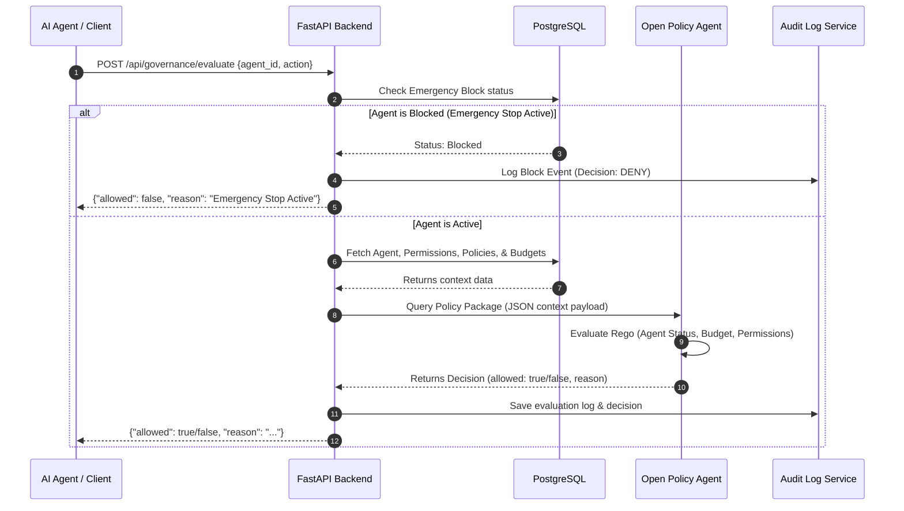

# Governance AI Agent 🛡️🤖

An enterprise-grade, full-stack **Governance Layer** designed to monitor, regulate, and audit autonomous AI agents. This platform enforces security compliance, evaluates permission boundaries, manages API budgets, logs all decisions, and provides a global emergency stop (kill switch) mechanism.

---

## 📖 Table of Contents
- [Core Features](#-core-features)
- [System Architecture](#-system-architecture)
- [Tech Stack](#-tech-stack)
- [Directory Structure](#-directory-structure)
- [Getting Started](#-getting-started)
  - [Prerequisites](#prerequisites)
  - [Infrastructure Setup (Docker)](#1-infrastructure-setup-docker)
  - [Backend Setup (FastAPI)](#2-backend-setup-fastapi)
  - [Frontend Setup (React + Vite)](#3-frontend-setup-react--vite)
- [Open Policy Agent (OPA) Integration](#-open-policy-agent-opa-integration)
- [API Endpoints](#-api-endpoints)

---

## 🌟 Core Features

- 📊 **Analytics Dashboard**: Real-time monitoring of agent activity, active budgets, total cost usage, policy violation logs, and system status.
- 🛡️ **OPA Policy Enforcement**: Centralized engine powered by Open Policy Agent (OPA) to evaluate complex Rego compliance rules.
- 🔑 **Fine-Grained Permissions**: Restrict agent activities (e.g., read, write, execute) dynamically based on agent context, scope, and user rights.
- 💸 **Budgetary Guardrails**: Establish spending limits (daily/monthly/per-run) and check costs before execution to prevent runway LLM expenses.
- 📝 **Immutable Audit Trails**: Automatically logs every evaluation request, database state, OPA decision, and violation for compliance audits.
- 🚨 **Emergency Kill Switch**: Instantly freeze all agent processes or block specific agents globally when anomalous or malicious behavior is detected.

---

## 🏗️ System Architecture

The following sequence illustrates the evaluation flow when an AI Agent requests an action through the Governance Layer:



---

## 💻 Tech Stack

### Frontend
- **Framework**: [React 19](https://react.dev/) + [Vite](https://vite.dev/) (Fast SPA builds)
- **Styling**: [Tailwind CSS v4](https://tailwindcss.com/) (Modern CSS system)
- **State & Queries**: [TanStack React Query v5](https://tanstack.com/query/latest) (Robust caching and synchronization)
- **Routing**: [React Router Dom v7](https://reactrouter.com/) (Single-page app routing)
- **Visualizations**: [Recharts](https://recharts.org/) (Interactive analytics dashboards)
- **Animations**: [Framer Motion](https://www.framer.com/motion/) (Smooth transitions & micro-interactions)
- **Forms**: [React Hook Form](https://react-hook-form.com/) & [Zod](https://zod.dev/) (Robust validation)

### Backend
- **Framework**: [FastAPI](https://fastapi.tiangolo.com/) (High-performance async Python framework)
- **ORM**: [SQLAlchemy 2.0](https://www.sqlalchemy.org/)
- **Database**: [PostgreSQL](https://www.postgresql.org/) (Relational persistent storage)
- **Cache / Rate Limiting**: [Redis](https://redis.io/)
- **Auth**: [JWT](https://jwt.io/) (JSON Web Tokens) with Passlib & Cryptography

### Security & Governance
- **Policy Engine**: [Open Policy Agent (OPA)](https://www.openpolicyagent.org/) (Rego policy definitions)

---

## 📂 Directory Structure

```text
governance-layer/
├── backend/
│   ├── app/
│   │   ├── api/            # API Router endpoints (auth, agents, policies, etc.)
│   │   ├── core/           # Security, dependencies, and configuration settings
│   │   ├── db/             # SQLAlchemy session and database setup
│   │   ├── models/         # SQLAlchemy database models
│   │   ├── schemas/        # Pydantic data schemas
│   │   ├── services/       # Core business logic handlers
│   │   └── OPA/            # OPA client, service, and Rego policies
│   │       ├── policies/   # Rego rules (agent.rego, budget.rego, etc.)
│   │       └── client.py   # OPA API Client integration
│   ├── .env                # Backend local environment configurations
│   ├── requirements.txt    # Python dependencies
│   └── make_admin.py       # Helper script to bootstrap administrative users
├── frontend/
│   ├── public/             # Static public assets
│   ├── src/
│   │   ├── api/            # Axios API client setups
│   │   ├── components/     # Reusable UI component libraries (ui, agents, budgets, etc.)
│   │   ├── context/        # React context providers (AuthContext)
│   │   ├── layouts/        # Global layout containers
│   │   ├── pages/          # Dashboard page components
│   │   ├── routes/         # Router declarations & ProtectedRoute setups
│   │   └── services/       # API call handlers grouped by module
│   ├── package.json        # Frontend NPM configurations
│   └── vite.config.js      # Vite build pipeline configs
├── docker-compose.yml      # Infrastructure setup (Postgres, Redis, OPA)
└── README.md               # Project documentation
```

---

## 🚀 Getting Started

### Prerequisites
- [Docker & Docker Compose](https://www.docker.com/) installed
- [Python 3.10+](https://www.python.org/) installed
- [Node.js 18+](https://nodejs.org/) installed

---

### 1. Infrastructure Setup (Docker)

Start the underlying database, cache, and policy engines using Docker:

```bash
docker compose up -d
```
This launches:
- **PostgreSQL**: Running on port `5432`
- **Redis**: Running on port `6379`
- **Open Policy Agent (OPA)**: Running on port `8181`

---

### 2. Backend Setup (FastAPI)

1. Navigate to the backend directory:
   ```bash
   cd backend
   ```
2. Create and activate a Python virtual environment:
   ```bash
   python -m venv venv
   # On Windows:
   .\venv\Scripts\activate
   # On Linux/macOS:
   source venv/bin/activate
   ```
3. Install the dependencies:
   ```bash
   pip install -r requirements.txt
   ```
4. Verify/configure your `.env` settings (set your database connection strings, JWT secret keys, and OPA address).
5. Start the FastAPI development server:
   ```bash
   uvicorn app.main:app --reload
   ```
   The API will be available at `http://localhost:8000` (docs available at `http://localhost:8000/docs`).

---

### 3. Frontend Setup (React + Vite)

1. Navigate to the frontend directory:
   ```bash
   cd ../frontend
   ```
2. Install npm dependencies:
   ```bash
   npm install
   ```
3. Run the Vite development server:
   ```bash
   npm run dev
   ```
   The dashboard will be available at `http://localhost:5173`.

---

## 🛡️ Open Policy Agent (OPA) Integration

OPA enforces safety and access constraints. The backend serializes the current governance context (permissions, budget metrics, agent status) and posts it to OPA.

### Rego Policies (`backend/app/opa/policies/`)
- `default.rego`: Orchestrates parent rules; mandates that all sub-policies (agent, budget, permissions) return `allow = true`.
- `agent.rego`: Ensures the target agent status is `ACTIVE`.
- `permission.rego`: Validates whether the user or agent has appropriate access tokens/rights.
- `budget.rego`: Compares current spending metrics against assigned threshold bounds.

To upload policies to the running OPA instance, run a PUT request:
```bash
curl -X PUT --data-binary @app/opa/policies/default.rego http://localhost:8181/v1/policies/governance
```

---

## 🔌 API Endpoints

| Category | Endpoint | Method | Description |
| :--- | :--- | :---: | :--- |
| **Auth** | `/api/auth/register` | `POST` | Registers a new user account |
| **Auth** | `/api/auth/login` | `POST` | Authenticates a user and issues JWT |
| **Governance** | `/api/governance/evaluate` | `POST` | Evaluates action against OPA & budgets |
| **Agents** | `/api/agents` | `GET`/`POST` | Lists or registers AI agents |
| **Policies** | `/api/policies` | `GET`/`POST` | Fetches or creates compliance policies |
| **Budgets** | `/api/budgets` | `GET`/`POST` | Configures or checks budget limits |
| **Emergency** | `/api/emergency/status` | `GET` | Checks if emergency stop is active |
| **Emergency** | `/api/emergency/toggle` | `POST` | Toggles global emergency stop switch |
| **Dashboard** | `/api/dashboard/stats` | `GET` | Fetches aggregated analytics summary |
