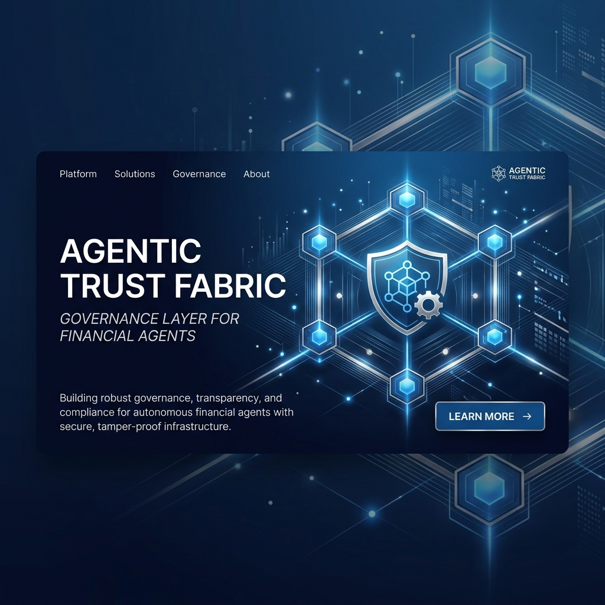
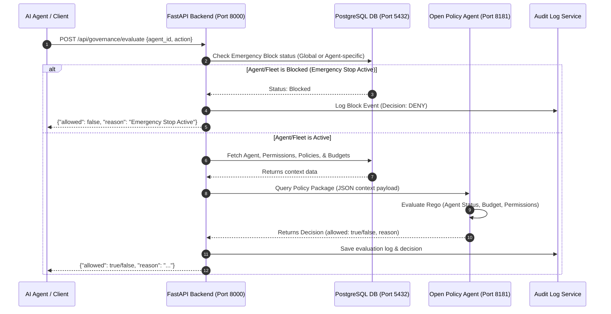

# Agentic Trust Fabric (ATF) - Governance Layer for Financial Agents 🛡️🤖



A high-performance safety, governance, and control plane that enables financial institutions to deploy fleets of autonomous AI agents responsibly — with granular per-agent permissions, dynamic spend caps, sub-millisecond kill-switch controls, real-time revocation, an immutable audit trail, and AI-driven autonomous SRE remediation.

---

## 📖 Table of Contents
- [Problem Statement](#problem-statement)
- [Overview & Core Concept](#overview--core-concept)
- [The Seven Security Mechanisms](#the-seven-security-mechanisms)
- [System Architecture](#system-architecture)
- [Entire Request & Governance Flow](#entire-request--governance-flow)
- [Directory Structure](#directory-structure)
- [Actual Technology Stack](#actual-technology-stack)
- [Getting Started](#getting-started)
- [API Endpoints Reference](#api-endpoints-reference)
- [Testing & Validation (Adversarial Harness)](#testing--validation-adversarial-harness)

---

## Problem Statement

As autonomous AI agents multiply across financial services, establishing robust safety infrastructure and guardrails is critical to ensuring security, compliance, and trust. 

Conventional IAM was built to govern **who is allowed to log in**. However, nothing in a traditional bank's stack governs **what an autonomous agent is allowed to do** in the few hundred milliseconds before it moves money. 

### The Failure Mode We Defend Against
A human insider commits fraud slowly, once, and alone. An agent fleet fails at **machine speed, simultaneously, and identically**—because hundreds of instances share the same model, prompt template, and deployment version. By the time an anomaly surfaces on a traditional monitoring dashboard, the incident is already complete. Therefore, governance for agents cannot be detective; **it must be preventive, inline, and blocking**. This makes the latency budget the hardest engineering constraint.

---

## Overview & Core Concept

**Agentic Trust Fabric (ATF)** is a governance and control plane that sits between any financial agent (fee-reversal bots, travel-rebooking concierges, servicing agents, dispute resolvers) and the downstream systems of record they act on.

```
AI Agent  ───►  Governance Gateway (FastAPI + OPA + Redis)  ───►  Bank APIs
```

### Core Design Principle: Enforcement by Credential Custody
The agent **never holds a downstream credential**. ATF's enforcement point is the sole custodian of every secret that touches core banking, card platforms, and customer communications. 

An agent submits an intent; if policy allows it, ATF returns a cryptographically signed capability token scoped to exactly one action, one resource, one amount ceiling, valid for a brief period (e.g., thirty seconds) and redeemable once. Systems of record reject any call that does not present a valid token. Bypass is not forbidden—it is structurally impossible.

---

## The Seven Security Mechanisms

ATF utilizes seven core security mechanisms tailored to the unique nature of agentic workflows:

1. **Attenuable Capability Tokens**: Permissions are carried in tokens whose scope can only be narrowed, never widened, enforced cryptographically. A delegated token is mathematically derived from the caller's token, so authority strictly decays along every delegation chain.
2. **A Risk Lattice, Not a Risk Threshold**: Actions are classified on two axes—*reversibility* and *blast radius*. Policy gates on the resulting cell rather than a single threshold (e.g., a $10 statement credit is reversible; a $10 outbound wire is not, hence they require different gates).
3. **Provenance and Taint Tracking**: Tags every piece of context the agent consumes (internal database, email, web scrapings) and propagates that taint into the authorization decision. Tainted actions are automatically demoted to harder gates.
4. **Budget Leases**: Rather than checking a central counter for every action (which creates a latency bottleneck), each enforcement instance leases a slice of the global budget and authorizes locally in microseconds.
5. **Epoch Revocation**: Push-based kill switches fail if a compromised agent is unresponsive. ATF invalidates the agent's authority. Every token carries a halt epoch, and resource servers reject anything below the current epoch. Emergency stop is one atomic increment.
6. **Decorrelated Dual Control**: For irreversible actions, ATF requires a checker agent that differs in model or prompt lineage from the proposer agent, re-deriving the conclusion from the system of record rather than the proposer's summary.
7. **Fleet Circuit Breakers and Canary Authority**: Statistical breakers (on spend velocity, denial rate) are run on the agent version level. New versions receive canary authority (e.g., 5% of traffic) with automatic rollback on drift.

---

## System Architecture

The following logical diagram shows the runtime layers and communication flows of the Agentic Trust Fabric:

```
                            [ Client / External Agent ]
                                        │
                                        ▼
                            [ React Operator Dashboard ]
                                (Port 5173 - Client)
                                        │
                            (HTTP APIs / Authentication)
                                        │
                                        ▼
                              [ FastAPI API Gateway ]
                               (Port 8000 - Backend)
                                        │
             ┌──────────────────────────┼──────────────────────────┐
             ▼                          ▼                          ▼
      [ Redis Cache ]         [ Open Policy Agent OPA ]     [ PostgreSQL DB ]
        (Port 6379)                  (Port 8181)               (Port 5432)
   - Emergency Status           - Rego Policy Rules       - User & Agent States
   - Hot Spend Cache            (agent/budget/permission) - Audit Logs & Budgets
```

### High-Fidelity Request Flow Sequence
The sequence below illustrates the evaluation lifecycle when an AI Agent requests an action:



---

## Entire Request & Governance Flow

### Allowed Request Lifecycle
```
Agent Request ──► Kill-Switch Check ──► Agent Status ──► OPA Policy ──► Spend Cap ──► Execute ──► Audit Log ──► Success Response
```

### Denied Request Lifecycle
If an action violates rules, permission levels, or budget caps, it is blocked immediately before execution:
```
Agent Request ──► OPA Policy Evaluation ──► DENIED (Exceeds Limit) ──► Write Audit Entry ──► Trigger UI Alert Banner ──► Return HTTP 403 / 200 (allowed=false)
```

---

## Directory Structure

```text
governance-layer/
├── assets/                 # Graphics and design assets (banner, logos)
├── backend/
│   ├── app/
│   │   ├── api/            # API Router endpoints (auth, agents, policies, etc.)
│   │   ├── core/           # Security, dependencies, and configuration settings
│   │   ├── db/             # SQLAlchemy session and database setup
│   │   ├── models/         # SQLAlchemy database models
│   │   ├── schemas/        # Pydantic data schemas
│   │   ├── services/       # Core business logic handlers
│   │   └── opa/            # OPA client, service, and Rego policies
│   │       ├── policies/   # Rego rules (agent.rego, budget.rego, etc.)
│   │       └── client.py   # OPA API Client integration
│   ├── .env                # Backend local environment configurations
│   ├── requirements.txt    # Python dependencies
│   └── make_admin.py       # Helper script to bootstrap administrative users
├── frontend/
│   ├── public/             # Static public assets
│   ├── src/
│   │   ├── api/            # Axios API client setups
│   │   ├── components/     # Reusable UI components (ui, agents, budgets, permissions, etc.)
│   │   ├── context/        # React context providers (AuthContext)
│   │   ├── layouts/        # Global layout containers
│   │   ├── pages/          # Dashboard page components
│   │   ├── routes/         # Router declarations & ProtectedRoute setups
│   │   └── services/       # API call handlers grouped by module
│   ├── package.json        # Frontend NPM configurations
│   └── vite.config.js      # Vite build pipeline configs
├── docker-compose.yml      # Infrastructure setup (PostgreSQL, Redis, OPA)
└── README.md               # Project documentation
```

---

## Actual Technology Stack

| Layer / Component | Technology Implemented | Purpose & Description |
| :--- | :--- | :--- |
| **Frontend Dashboard** | React 19, Vite, Recharts, Framer Motion, Vanilla CSS | Real-time SRE operator dashboard and control pane. |
| **API Gateway & Router** | FastAPI (Python 3.10+), SQLAlchemy 2.0 | Core governance router, audit logger, and API database sync. |
| **Policy Engine** | Open Policy Agent (OPA), Rego | Declarative policy-as-code evaluation engine on port 8181. |
| **Database Store** | PostgreSQL 16 (Relational Database) | Primary persistence for users, agents, policies, and audit logs. |
| **In-Memory Cache** | Redis 7 (Alpine) | Ultra-fast caching, rate-limiting, and state store. |
| **Containerization** | Docker, Docker Compose | Orchestrates Postgres, Redis, and OPA microservices. |

---

## Getting Started

### Prerequisites
- [Docker & Docker Compose](https://www.docker.com/) installed
- [Python 3.10+](https://www.python.org/) installed
- [Node.js 18+](https://nodejs.org/) installed

### 1. Infrastructure Setup (Docker)
Start the database, cache, and policy engines:
```bash
docker compose up -d
```
This launches:
- **PostgreSQL**: Running on port `5432`
- **Redis**: Running on port `6379`
- **Open Policy Agent (OPA)**: Running on port `8181`

### 2. Backend Setup (FastAPI)
1. Navigate to the backend directory:
   ```bash
   cd backend
   ```
2. Create and activate a Python virtual environment:
   ```bash
   python -m venv venv
   # On Windows:
   .\venv\Scripts\activate
   # On Linux/macOS:
   source venv/bin/activate
   ```
3. Install the dependencies:
   ```bash
   pip install -r requirements.txt
   ```
4. Verify or configure your `.env` settings (e.g. database connection strings, keys).
5. Start the FastAPI development server:
   ```bash
   uvicorn app.main:app --reload
   ```
   The API will be available at `http://localhost:8000` (Swagger docs at `http://localhost:8000/docs`).

### 3. Frontend Setup (React + Vite)
1. Navigate to the frontend directory:
   ```bash
   cd ../frontend
   ```
2. Install npm dependencies:
   ```bash
   npm install
   ```
3. Run the Vite development server:
   ```bash
   npm run dev
   ```
   The dashboard will be available at `http://localhost:5173`.

---

## API Endpoints Reference

| Category | Endpoint | Method | Description |
| :--- | :--- | :---: | :--- |
| **Auth** | `/api/auth/register` | `POST` | Registers a new user account |
| **Auth** | `/api/auth/login` | `POST` | Authenticates a user and issues JWT |
| **Auth** | `/api/auth/me` | `GET` | Fetches active user session information |
| **Governance** | `/api/governance/evaluate` | `POST` | Evaluates action against OPA, status, & budgets |
| **Agents** | `/api/agents` | `GET`/`POST` | Lists or registers AI agents |
| **Agents** | `/api/agents/{id}` | `GET`/`PUT`/`DELETE` | Retrieve, update, or remove an agent |
| **Policies** | `/api/policies` | `GET`/`POST` | Fetches or creates compliance policies |
| **Policies** | `/api/policies/{id}` | `GET`/`PUT`/`DELETE` | Retrieve, update, or remove a policy |
| **Permissions** | `/api/permissions` | `GET`/`POST` | Configure user permissions for agents |
| **Permissions** | `/api/permissions/{id}` | `GET`/`PUT`/`DELETE` | Manage a specific permission entry |
| **Budgets** | `/api/budgets` | `GET`/`POST` | Configures or checks budget limits |
| **Budgets** | `/api/budgets/{id}` | `GET`/`PUT`/`DELETE` | Manage a specific budget entry |
| **Emergency** | `/api/emergency/status` | `GET` | Checks if emergency stop is active (global or agent-level) |
| **Emergency** | `/api/emergency/global/enable` | `POST` | Enables global emergency stop switch |
| **Emergency** | `/api/emergency/global/disable` | `POST` | Disables global emergency stop switch |
| **Emergency** | `/api/emergency/agent/{agent_id}/enable` | `POST` | Enables emergency stop for a specific agent |
| **Emergency** | `/api/emergency/agent/{agent_id}/disable` | `POST` | Disables emergency stop for a specific agent |
| **Dashboard** | `/api/dashboard/summary` | `GET` | Fetches aggregated analytics summary |
| **Dashboard** | `/api/dashboard/agents` | `GET` | Fetches agent-specific statistics |
| **Dashboard** | `/api/dashboard/policies` | `GET` | Fetches policy enforcement statistics |
| **Dashboard** | `/api/dashboard/budgets` | `GET` | Fetches spend and budget statistics |
| **Dashboard** | `/api/dashboard/audit` | `GET` | Fetches audit statistics |
| **Dashboard** | `/api/dashboard/emergency` | `GET` | Fetches active emergency stop status statistics |

---

## Testing & Validation (Adversarial Harness)

The Agentic Trust Fabric is designed to be validated against an adversarial harness testing execution safety:

| Attack | What the Agent Tries | Control That Must Catch It |
| :--- | :--- | :--- |
| **Direct API Bypass** | Call downstream core banking systems directly | **Credential custody**—no valid token exists to present |
| **Confused Deputy** | Low-cap agent invokes high-cap agent on its behalf | **Token attenuation**—authority strictly decays down the chain |
| **Prompt-Injected Refund** | Attacker instructions inside inputs force a payment | **Provenance & taint tracking**—downgrades authorization |
| **Cap Splitting** | Hundreds of sub-threshold transactions to evade caps | **Rolling spend window & velocity limits** |
| **Correlated Fleet Drain** | Multi-instance simultaneous budget exhaustion | **Global fleet ceiling & version-keyed breaker** |
| **Token Replay** | Re-presenting a previously authorized capability token | **Single-use nonce burn** |
| **Stale Authority** | Using a token minted before a halt/revocation epoch | **Halt epoch comparison** at the resource server |
| **Retry after Denial** | Repeating denied requests with tiny mutations | **Trust-score decay & automatic throttle** |
| **Reason Laundering** | Restating an irreversible action as a reversible one | **Action-class lattice gating** rather than description text |
